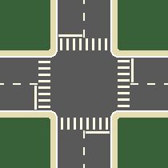
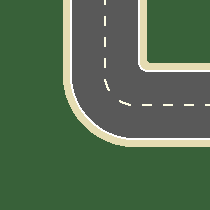

<!-- Improved compatibility of back to top link: See: https://github.com/othneildrew/Best-README-Template/pull/73 -->
<a name="readme-top"></a>
<!--
*** Thanks for checking out the Best-README-Template. If you have a suggestion
*** that would make this better, please fork the repo and create a pull request
*** or simply open an issue with the tag "enhancement".
*** Don't forget to give the project a star!
*** Thanks again! Now go create something AMAZING! :D
-->

<!-- PROJECT LOGO -->
<br />
<div align="center">
  <a href="https://github.com/pasblo/Tiled-traffic-sim">
    
  </a>

<h3 align="center">Tiled traffic simmulator</h3>

  <p align="center">
    A traffic system simulator for characterizing the chrash probabilities with different VANET algorithms
    <br />
    <a href="https://github.com/pasblo/Tiled-traffic-sim"><strong>Explore the docs »</strong></a>
    <br />
    <br />
    <a href="https://github.com/pasblo/Tiled-traffic-sim/tree/main/images/Traffic_sim_video.mp4">View Demo</a>
    ·
    <a href="https://github.com/pasblo/Tiled-traffic-sim/issues">Report Bug</a>
    ·
    <a href="https://github.com/pasblo/Tiled-traffic-sim/issues">Request Feature</a>
  </p>
</div>


<!-- TABLE OF CONTENTS -->
<details>
  <summary>Table of Contents</summary>
  <ol>
    <li>
      <a href="#about-the-project">About The Project</a>
      <ul>
        <li><a href="#map-tiles">Map tiles</a></li>
        <li><a href="#creating-a-map-from-map-tiles">Creating a map from map tiles</a></li>
        <li><a href="#tiles-provided">Tiles provided</a></li>
        <li><a href="#creating-new-tiles">Creating new tiles</a></li>
        <li><a href="#built-with">Built with</a></li>
      </ul>
    </li>
    <li>
      <a href="#getting-started">Getting Started</a>
      <ul>
        <li><a href="#prerequisites">Prerequisites</a></li>
        <li><a href="#installation">Installation</a></li>
      </ul>
    </li>
    <li><a href="#examples">Examples</a></li>
    <li><a href="#contributing">Contributing</a></li>
    <li><a href="#license">License</a></li>
    <li><a href="#contact">Contact</a></li>
    <li><a href="#acknowledgments">Acknowledgments</a></li>
  </ol>
</details>


<!-- ABOUT THE PROJECT -->
## About The Project


This project focuses on simulating autonomous vehicle behavior, incorporating basic driving rules and vehicle-to-vehicle communication via a VANET algorithm to analyze collision rates among deployed vehicles.

<br/><br/>

### Map tiles

The map comprises various tiles, each consisting of an image and a JSON file containing metadata about turning points, stopping points, or traffic lights. These files are organized such that when a map is created, all JSON files are combined into one for the entire map, considering the positioning of tiles. This process is automated by `MapCreator.py`.

All classes related to different types of objects found on each tile are located in `Map.py`. Each class definition includes a constructor that takes a dictionary with all parameters and another function that returns all parameters in JSON dictionary format. For example:
```python
class Turn:
    """
    Class representing a semicircle defined by the position of its center,
    two angles (start and end of the semicircle),
    and two distances indicating the semicircle's minor and major radius.
    """
    def __init__(self, specs):
        """
        Initializes a Turn object.

        Args:
            specs (dict): A dictionary containing specifications for the Turn.

        Returns:
            None
        """
        self.id = specs["id"]
        self.x = specs["x"]
        self.y = specs["y"]
        self.first_angle = math.radians(specs["first-angle"])
        self.second_angle = math.radians(specs["second-angle"])
        self.min_distance = specs["min-distance"]
        self.max_distance = specs["max-distance"]
        self.can_skip = specs["can-skip"]
        self.calculate_border_lines()
        self.calculate_turn_span()
    
    def get_json_dictionary(self):
        """
        Returns a dictionary representing the Turn object in JSON format.

        Args:
            None

        Returns:
            dict: A dictionary containing the attributes of the Turn object.
        """
        return {
            "id": self.id,
            "x": self.x,
            "y": self.y,
            "first-angle": math.degrees(self.first_angle),
            "second-angle": math.degrees(self.second_angle),
            "min-distance": self.min_distance,
            "max-distance": self.max_distance,
            "can-skip": self.can_skip
        }
    ...
```

All different object are located in another dictionary that forms the map tile, here is an example:

```json
{
    "stops":[
        {
            "id":0,
            "start-x":45,
            "start-y":137,
            "end-x":45,
            "end-y":107,
            "trigger-traffic-light-id":0
        },
        {
            "id":1,
            "start-x":73,
            "start-y":45,
            "end-x":103,
            "end-y":45,
            "trigger-traffic-light-id":1
        },
        {
            "id":2,
            "start-x":165,
            "start-y":73,
            "end-x":165,
            "end-y":103,
            "trigger-traffic-light-id":2
        },
        {
            "id":3,
            "start-x":137,
            "start-y":165,
            "end-x":107,
            "end-y":165,
            "trigger-traffic-light-id":3
        }
    ],
    "turns":[
        {
            "id":0,
            "x":138,
            "y":138,
            "first-angle":90,
            "second-angle":180,
            "min-distance":1,
            "max-distance":33,
            "can-skip":"True"
        },
        {
            "id":1,
            "x":72,
            "y":138,
            "first-angle":0,
            "second-angle":90,
            "min-distance":1,
            "max-distance":33,
            "can-skip":"True"
        },
        {
            "id":2,
            "x":72,
            "y":138,
            "first-angle":0,
            "second-angle":90,
            "min-distance":33,
            "max-distance":66,
            "can-skip":"True"
        },
        {
            "id":3,
            "x":138,
            "y":138,
            "first-angle":90,
            "second-angle":180,
            "min-distance":33,
            "max-distance":66,
            "can-skip":"True"
        },
        {
            "id":4,
            "x":138,
            "y":72,
            "first-angle":180,
            "second-angle":270,
            "min-distance":1,
            "max-distance":33,
            "can-skip":"True"
        },
        {
            "id":5,
            "x":72,
            "y":72,
            "first-angle":270,
            "second-angle":0,
            "min-distance":1,
            "max-distance":33,
            "can-skip":"True"
        },
        {
            "id":6,
            "x":72,
            "y":72,
            "first-angle":270,
            "second-angle":0,
            "min-distance":33,
            "max-distance":66,
            "can-skip":"True"
        },
        {
            "id":7,
            "x":138,
            "y":72,
            "first-angle":180,
            "second-angle":270,
            "min-distance":33,
            "max-distance":66,
            "can-skip":"True"
        }
    ],
    "traffic-lights":[
        {
            "id":0,
            "x":45,
            "y":157,
            "default-color":"red",
            "default-time-in":0,
            "time-red":12,
            "time-amber":2,
            "time-green":4
        },
        {
            "id":1,
            "x":53,
            "y":45,
            "default-color":"red",
            "default-time-in":4,
            "time-red":12,
            "time-amber":2,
            "time-green":4
        },
        {
            "id":2,
            "x":165,
            "y":53,
            "default-color":"red",
            "default-time-in":8,
            "time-red":12,
            "time-amber":2,
            "time-green":4
        },
        {
            "id":3,
            "x":157,
            "y":165,
            "default-color":"green",
            "default-time-in":0,
            "time-red":12,
            "time-amber":2,
            "time-green":4
        }
    ],
    "road-connections":[
        {
            "angle":0
        },
        {
            "angle":90
        },
        {
            "angle":180
        },
        {
            "angle":270
        }
    ]
}
```

NOTE: This json file is being used to define the traffic light crossroads tile as it can been below



<br/><br/>

### Creating a map from map tiles

With all tiles defined, the map is created just by using a 2D array of dictionaries (First array indicates row, second indicates column) that indicate where is each tile and what rotation does it have. As mentioned above, all map creation is handeled by MapCreator.py, so its independant from the main simulator, the simulator runs over the json file created by the map creator tool. In this example, the map is generated at the begining of the Simulator file just for the convenience.

Example of a map descriptor array:
```python
map_descriptor = [[{"Tile":1, "Rotation":0, "Spawn-speed":0.75, "Spawn-probability":1}, {"Tile":4, "Rotation":0}, {"Tile":1, "Rotation":0}, {"Tile":5, "Rotation":0}, {"Tile":2, "Rotation":180}], [{"Tile":0, "Rotation":0}, {"Tile":1, "Rotation":90}, {"Tile":0, "Rotation":0}, {"Tile":4, "Rotation":90}, {"Tile":3, "Rotation":0, "Spawn-speed":0.75, "Spawn-probability":1}], [{"Tile":2, "Rotation":270}, {"Tile":6, "Rotation":0}, {"Tile":4, "Rotation":0}, {"Tile":2, "Rotation":90}, {"Tile":1, "Rotation":90}], [{"Tile":2, "Rotation":90, "Spawn-speed":0.75, "Spawn-probability":1}, {"Tile":2, "Rotation":0}, {"Tile":3, "Rotation":0}, {"Tile":2, "Rotation":180}, {"Tile":1, "Rotation":90}], [{"Tile":0, "Rotation":0}, {"Tile":0, "Rotation":0}, {"Tile":1, "Rotation":90, "Spawn-speed":0.75, "Spawn-probability":1}, {"Tile":2, "Rotation":0}, {"Tile":2, "Rotation":90}]]
```

This map descriptor array will generate the following map image:


<br/><br/>

### Tiles provided

A set of basic map tiles is provided, encompassing various road configurations to facilitate diverse traffic simulations. Below are visual representations of each tile along with their descriptions:

**Controlled Crossroad**  
**Description:** This tile features a controlled intersection with stops but no traffic lights, ensuring orderly movement of vehicles from all directions.  


**Controlled T-Intersection**  
**Description:** This T-shaped intersection contains a stop signal to incorporate to the incoming traffic, providing organized traffic flow between the main road and a secondary road.  


**Grass**  
**Description:** The grass tile represents areas of greenery or open space, ideal for separating different road segments or adding aesthetic elements to the map.  


**Straight Road**  
**Description:** A straight section of road suitable for simulating traffic movement in a linear direction without any intersections.  


**Traffic Light Controlled Crossroad**  
**Description:** Similar to the controlled crossroad, this tile features traffic lights at the intersection, regulating vehicle movement for smooth traffic flow.  


**Turn**  
**Description:** This tile represents a 90º curved section of road, allowing simulation of turns and bends in the traffic route.  



**Uncontrolled Crossroad**  
**Description:** An intersection without traffic lights or stop signs, where vehicle right-of-way is determined by standard traffic rules or VANET conventions.  


These tiles provide a foundation for creating diverse road networks and scenarios within the vehicle traffic simulator.

<br/><br/>

### Creating new tiles

On top of using existing tiles, this project allows a very simple way of creating new tiles.

1. **Create the image**
   Create an image of 210 x 210 pixels with roads appearing only on one of each side.

2. **Create the json file**
   Create a json file with the same name as the image just created and make sure to copy any exixting json file and take it as base.

3. **Add the created tile**
   Go to `MapTile.py` and add a new contant with the name and the next id for the new tile, then add that constant to the list of tiles below on the last place.

A detailed series of tutorials detailing how the simulator works, how to program it and how to add tiles with examples will be publishing duing the first and second quarter of 2024 on my youtube channel.

<br/><br/>

### Built With

- [Python](https://www.python.org/)
- [Pygame](https://www.pygame.org/)
- [ComsChannelSim](https://github.com/pasblo/ComsChannelsSim)


<p align="right">(<a href="#readme-top">back to top</a>)</p>


<!-- GETTING STARTED -->
## Getting Started

### Prerequisites

Python 3.10.X is required to run this library

Check out also the requirements from [my own library for aerial channel comunications](https://github.com/pasblo/ComsChannelsSim)


### Installation

1. Clone the repo
   ```sh
   git clone https://github.com/pasblo/Tiled-traffic-sim
   ```
2. Install PIP packages
   ```sh
   py -3.10 -m pip install pygame
   ```
3. Execute the simulation
   ```js
   py -3.10 .\Simulator.py
   ```

<p align="right">(<a href="#readme-top">back to top</a>)</p>


<!-- USAGE EXAMPLES -->
## Examples

### 5 x 5 map tiles

[](http://www.youtube.com/watch?v=7TOujYuhqcs)

### 10 x 10 map tiles

[](http://www.youtube.com/watch?v=Un0zIqAsXL0)

<p align="right">(<a href="#readme-top">back to top</a>)</p>


<!-- CONTRIBUTING -->
## Contributing

Contributions are what make the open source community such an amazing place to learn, inspire, and create. Any contributions you make are **greatly appreciated**.

If you have a suggestion that would make this better, please fork the repo and create a pull request. You can also simply open an issue with the tag "enhancement".
Don't forget to give the project a star! Thanks again!

1. Fork the Project
2. Create your Feature Branch (`git checkout -b feature/AmazingFeature`)
3. Commit your Changes (`git commit -m 'Add some AmazingFeature'`)
4. Push to the Branch (`git push origin feature/AmazingFeature`)
5. Open a Pull Request

<p align="right">(<a href="#readme-top">back to top</a>)</p>


<!-- LICENSE -->
## License

Distributed under the MIT License. See `LICENSE.txt` for more information.

<p align="right">(<a href="#readme-top">back to top</a>)</p>


<!-- CONTACT -->
## Contact

Pablo Rivero Lazaro - [@pabriv4693](https://www.youtube.com/@pabriv4693/featured) - pasblo39@gmail.com

LinkedIn - [Pablo Rivero Lazaro](https://www.linkedin.com/in/pablo-rivero-l%C3%A1zaro-961333207/)

Project Link: [https://github.com/pasblo/Tiled-traffic-sim](https://github.com/pasblo/Tiled-traffic-sim)

<p align="right">(<a href="#readme-top">back to top</a>)</p>


<!-- ACKNOWLEDGMENTS -->
## Acknowledgments

* [Inspiration for the project](https://github.com/mihir-m-gandhi/Basic-Traffic-Intersection-Simulation)
* [My own library for aerial channel comunications](https://github.com/pasblo/ComsChannelsSim)
* []()

<p align="right">(<a href="#readme-top">back to top</a>)</p>


<!-- MARKDOWN LINKS & IMAGES -->
<!-- https://www.markdownguide.org/basic-syntax/#reference-style-links -->
[license-shield]: https://img.shields.io/github/license/github_username/repo_name.svg?style=for-the-badge
[license-url]: https://github.com/github_username/repo_name/blob/master/LICENSE.txt
[linkedin-shield]: https://img.shields.io/badge/-LinkedIn-black.svg?style=for-the-badge&logo=linkedin&colorB=555
[linkedin-url]: https://www.linkedin.com/in/pablo-rivero-l%C3%A1zaro-961333207/